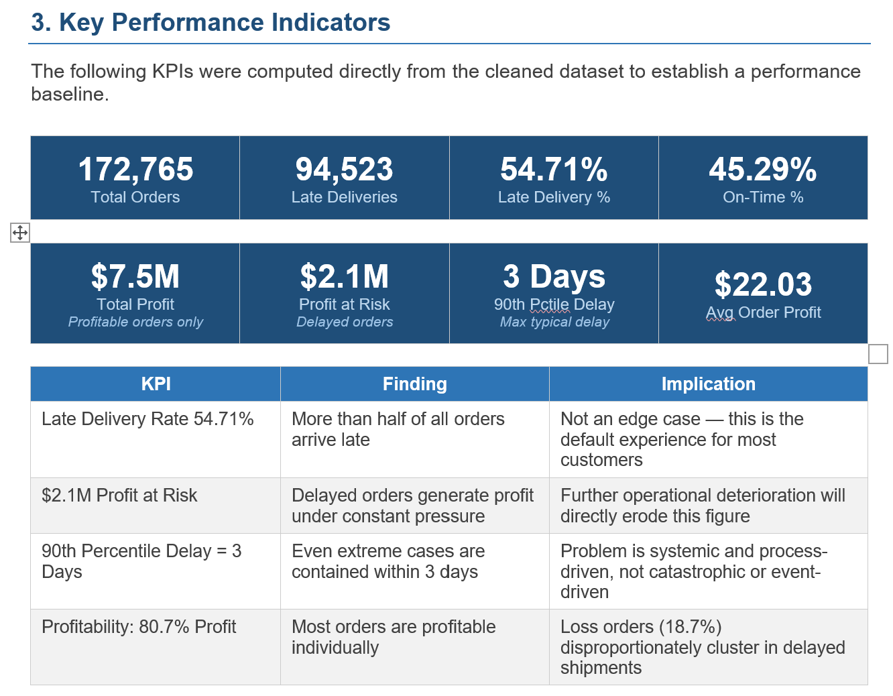
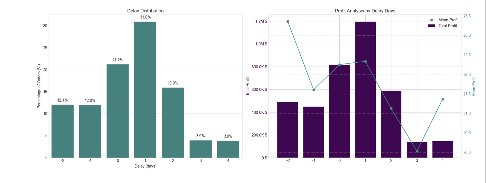
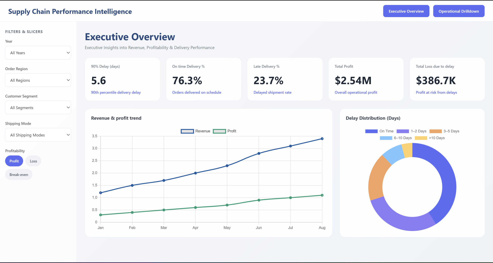
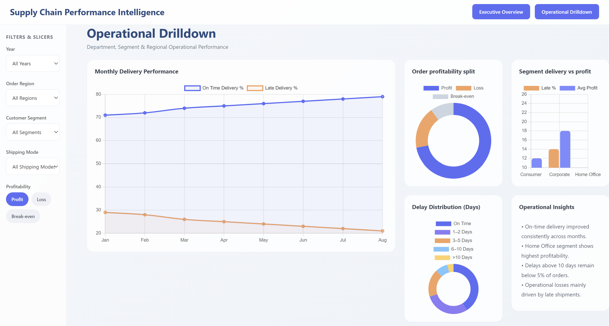

# Supply-Chain-Performance-Analysis
### End-to-End Delivery & Profitability Analytics | SQL Server · Python · Power BI

---

## 📌 Project Overview

A global e-commerce company operating across multiple regions manages end-to-end order fulfillment for a diverse product catalogue spanning Sporting Goods, Fitness Equipment, Footwear, and Apparel. The company faces **chronic delivery performance issues** — actual shipping times frequently deviate from scheduled windows, directly eroding customer trust and order profitability.

This project delivers a **complete analytical pipeline**: from raw data in SQL Server, through Python-based EDA and predictive modelling, to an interactive Power BI dashboard — answering the question: *why are 54.71% of orders arriving late, and what can be done about it?*

---

## 🎯 Business Questions Answered

| # | Question | Answered In |
|---|---|---|
| 1 | What is the true scale and financial cost of the late delivery problem? | EDA + KPI Section |
| 2 | Which shipping modes, regions, and departments drive the highest delay rates? | Bottleneck Detection |
| 3 | Are there time-based patterns indicating systemic process breakdowns? | Time-Based Analysis |
| 4 | Can we predict which orders will be late before they are dispatched? | ML Model |

---

## 📊 Key Findings

```
┌─────────────────────────────────────────────────────────────┐
│  Late Delivery Rate   →   54.71%   (94,523 of 172,765)      │
│  Total Profit         →   $7.5M    (profitable orders)       │
│  Profit at Risk       →   $2.1M    (on delayed orders)       │
│  ML Model Accuracy    →   74%      (Random Forest + SMOTE)   │
│  90th Pctile Delay    →   3 days   (systemic, not extreme)   │
└─────────────────────────────────────────────────────────────┘
```

- **Standard Class** shipping is the primary bottleneck — highest volume AND highest delay rate
- All **3 customer segments** show identical ~54% delay rates, confirming the issue is systemic
- **$2.1M profit** sits on orders with late delivery risk
- Delay magnitude is small (≤3 days at 90th percentile) — this is a fixable process problem, not a capacity crisis

---

## 🗂️ Project Structure

```
supply-chain-analysis/
│
├── 📓 Supply_Chain_Analysis_Upgraded.ipynb    # Main Jupyter notebook (full analysis)
├── 📊 Supply_Chain_PowerBI_Dashboard.pbix     # Power BI dashboard (2 tabs)
├── 📄 Supply_Chain_Performance_Report.docx    # Detailed project report
├── 🗃️ DataCoSupplyChainDataset.csv            # Source dataset
└── 📖 README.md
```

---

## 🔧 Tech Stack & Pipeline

```
SQL Server (Express)
        │
        │  SELECT * FROM DataCoSupplyChainDataset
        │  [Windows Authentication — no credentials in code]
        ▼
  Jupyter Notebook  ──►  pandas · numpy · seaborn · matplotlib
        │
        │  EDA → Cleaning → Feature Engineering
        │  Bottleneck Detection → Root Cause Analysis
        │  Time-Based Patterns → ML Model (Random Forest)
        ▼
    Power BI Dashboard
        │
        ├── Tab 1: Executive Overview  (KPIs + Delivery Trends)
        └── Tab 2: Operational Drilldown  (Bottlenecks + Profitability)
```

---

## 📁 Dataset

**Source:** [DataCo Smart Supply Chain Dataset ]()

| Detail | Value |
|---|---|
| Raw Records | 180,519 |
| Post-Cleaning Records | 172,765 |
| Raw Columns | 53 |
| Analytical Columns | 20 (after cleaning) |
| Geography | Multiple international markets |

---

## 🧹 Data Cleaning Summary

Columns were removed based on clearly defined criteria — not arbitrarily:

| Reason | Columns Removed |
|---|---|
| **PII / Privacy** | Customer Email, Password, Full Name, Street |
| **100% Missing** | Product Description, Product Image |
| **High Missingness (86%)** | Order Zipcode |
| **Redundant / Duplicate** | Benefit per Order (≡ Profit Per Order), all ID columns |
| **Zero Variance** | Product Status (single value across all rows) |
| **Geographic Reduction** | City/State columns (Region/Market sufficient) |

## KPIs

---

## ⚙️ Feature Engineering

| Feature | Formula | Purpose |
|---|---|---|
| `Order Processing Time` | Shipping Date − Order Date | Actual fulfilment lead time |
| `Delay` | Processing Time − Scheduled Days | Signed delay metric |
| `Is_Delayed` | Delay > 0 | Binary classification target |
| `Profitability Flag` | Profit / Loss / Break-even | Order financial segmentation |
| `order_month` | Month of order date | Seasonality analysis |
| `order_day` | Day name of order date | Day-of-week pattern analysis |
| `order_hour` | Hour of order date | Intra-day timing analysis |

## Profitability Vs Delivery Time Analysis


---

## 🤖 Machine Learning Model

**Objective:** Predict whether an order will be late *at the time of placement* — enabling proactive intervention before the delay occurs.

| Step | Choice | Reason |
|---|---|---|
| Algorithm | Random Forest Classifier | Handles mixed types, robust to noise, interpretable |
| Class Imbalance | SMOTE on training set only | ~57/43 imbalance; test set never oversampled |
| Key Metric | Recall prioritised | Missing a late order is more costly than a false alarm |

**Results:**

| Metric | Score |
|---|---|
| Accuracy | 74% |
| Precision | 79% |
| Recall | 75% |
| F1 Score | 0.77 |

> If the model flags 100 orders as high-risk, 79 of them will genuinely be late. Of all orders that actually go late, the model catches 75% of them.

---

## 💡 Strategic Recommendations

### Immediate (0–3 months)
1. **Shipping Mode Reallocation** — Auto-upgrade tight-window Standard Class orders to First Class
2. **Deploy ML Model** — Integrate into order management system to flag at-risk orders at placement
3. **Regional SLA Review** — Extend delivery windows in high-delay regions to match actual capacity

### Medium-Term (3–12 months)
4. **Department Capacity Audit** — Targeted process review for departments with above-average delay rates
5. **Seasonal Staffing Plan** — 15–20% staffing buffer in historically high-delay months

---




## 🚀 How to Run

### Prerequisites
```
Python 3.9+
SQL Server Express (with ODBC Driver 17)
Jupyter Notebook / JupyterLab
Power BI Desktop
```

### Python Dependencies
```bash
pip install pandas numpy matplotlib seaborn sqlalchemy pyodbc scikit-learn imbalanced-learn
```


## 📂 Skills Demonstrated

- **SQL** — Database connection via SQLAlchemy, Windows Auth integration, query extraction
- **Python (EDA)** — Data cleaning, feature engineering, missing value handling
- **Python (Visualisation)** — seaborn, matplotlib with consistent professional colour theme
- **Python (ML)** — Random Forest, SMOTE balancing, precision/recall/F1 evaluation
- **Power BI** — KPI cards, bar/line/map visuals, slicers, cross-filtering, DAX measures
- **Business Thinking** — Root cause framing, financial impact quantification, actionable recommendations
- **Documentation** — Structured markdown cells, inline code comments, project report

